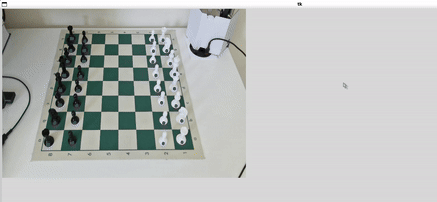

## Chess Game Tracker

This is a prototype system for chess game tracking in real time, created for my Bachelors thesis. 

## Modules

- `main.py` - initializing TKInter instance for board image display on screen
- `board/`- module, representing the board state. Updates and saves current board state. Contains classes representing squares, changes and pieces.
- `gameTacker.py` - controls what is displayed on TKInter, processes move detection
- `LiveChess2FEN/` - modules imported from `https://github.com/davidmallasen/LiveChess2FEN`. Used for square corner detection.
- `chesscog/`- modules imported from `https://github.com/georg-wolflein/chesscog`
- `predictor.py` - module responsible for obtaining data from object detectors. Trained and ready to use object detectors are stored in `/models`

## Usage
 - Install required dependencies
 - In `settings.yaml`, change `CAMERA_URL` to your camera url. Ex. `0` or other valid cv2 video capture arguments. 
 - Run main.py, change `process_move_mock` to `process_move` to switch between mock images and webcam capture
 - An empty window should appear. Press `a` when ready to start corner detection.
 - When a move is made on the board, press `a` again to process that move.

## Disclaimer

- All code under the directory `/chesscog` is created by authors of repository https://github.com/georg-wolflein/chesscog/tree/master . 

- All code under the directory `LiveChess2FEN` is created by authors of repository https://github.com/davidmallasen/LiveChess2FEN.